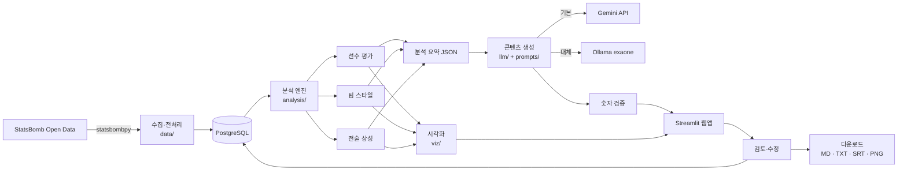
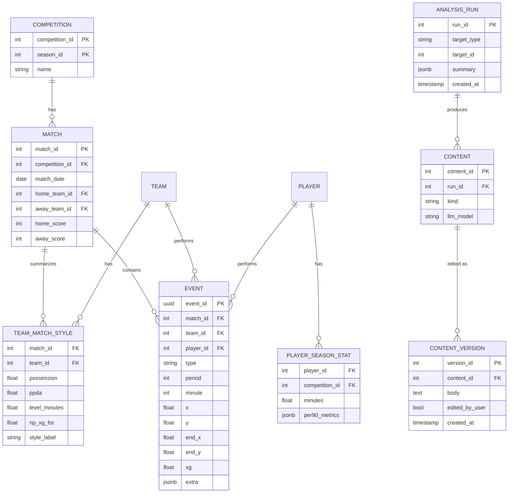

# LLM 기반 유튜브 콘텐츠 제작 자동화 — 상세 개발 기획서

> 작성: 안형준 (AX 2기) · 작성일: 2026-10-08 · 관련 일감: Redmine #217
> 상태: **기획 검토 요청** (기술 스택 확정과 개발 착수는 튜터 승인 후 진행)

---

## 1. 프로젝트 개요 및 개발 목표

### 1.1 배경
축구 분석 유튜브를 혼자 운영하려면 경기 데이터를 찾고, 분석하고, 그래픽을 만들고, 대본·제목·설명문을 쓰는 일을 모두 혼자 해야 한다. 영상 한 편에 드는 시간 대부분이 **분석 자료 준비와 글쓰기**에 쓰인다.

이 프로젝트는 그 과정을 자동화해서, **1인 크리에이터가 데이터에 근거한 분석 콘텐츠를 꾸준히 만들 수 있게** 하는 도구를 만든다.

### 1.2 개발 목표
1. 공개 축구 데이터로 **선수·팀·전술을 수치로 분석**하고 시각화한다.
2. 분석 결과를 근거로 LLM이 **분석 보고서, 영상 기획, 대본, 제목·설명문·썸네일 문구**를 생성한다.
3. 사용자가 생성 결과를 **검토·수정·다운로드**할 수 있는 Streamlit 웹앱으로 제공한다.
4. 분야별 분석 모듈과 콘텐츠 생성 모듈을 분리해서, 이후 **다른 유튜브 분야로 확장**할 수 있는 구조로 만든다.

### 1.3 핵심 설계 원칙: "숫자는 코드가, 글은 LLM이"
| 역할 | 담당 | 이유 |
|---|---|---|
| 통계 계산, 비교, 순위, 전술 분류 | **Python 코드** (Pandas, scikit-learn) | 결과가 정확하고, 같은 입력에 같은 결과가 나오며, 근거를 설명할 수 있다 |
| 보고서·대본·제목 등 글쓰기 | **LLM** | 분석 결과를 자연스러운 문장으로 바꾸는 데 강하다 |

LLM에게는 **계산이 끝난 수치만** 넘기고, LLM이 새로운 숫자를 지어내지 않도록 프롬프트와 검증 단계로 막는다(7장 참고). LLM이 직접 통계를 추론하게 하면 그럴듯하지만 틀린 수치(환각)가 나올 위험이 크기 때문이다.

### 1.4 주요 사용자
- **1차 사용자**: 축구 분석 콘텐츠를 만드는 1인 유튜버 (본인)
- **2차 사용자**: 축구 데이터 분석을 공부하는 사람, 소규모 스포츠 미디어

### 1.5 활용 시나리오
> 이번 주에 "레버쿠젠은 어떻게 무패 우승을 했나" 영상을 만들고 싶다.

1. 웹앱에서 대회(분데스리가 2023/24)와 팀(레버쿠젠)을 고른다.
2. 팀 스타일 분석(점유율, 압박 강도, 공격 경로 등)과 핵심 선수 평가를 확인한다.
3. 패스맵·슈팅맵 등 영상에 넣을 그래픽을 내려받는다.
4. "분석 보고서 생성"을 누르면 LLM이 수치를 근거로 보고서를 쓴다.
5. "영상 대본 생성"에서 길이(숏폼 1분 / 롱폼 10분)와 말투를 고르면 대본 초안이 나온다.
6. 제목 후보 5개, 설명문, 썸네일 문구를 생성한다.
7. 결과를 화면에서 고친 뒤 Markdown/텍스트 파일로 내려받아 영상 편집(DaVinci Resolve)에 쓴다.

---

## 2. 주요 기능 및 MVP 범위

### 2.1 기능 목록과 우선순위
| # | 기능 | 구분 | 상태 |
|---|---|---|---|
| F1 | 축구 경기 데이터 수집 및 전처리 | **MVP** | 프로토타입 완료 |
| F2 | 선수 평가 (같은 포지션 대비 퍼센타일) | **MVP** | 프로토타입 완료 |
| F3 | 팀 전술 스타일 분석 | **MVP** | 프로토타입 완료 |
| F4 | 시각화 (패스맵, 슈팅맵, 퍼센타일 차트) | **MVP** | 일부 완료 |
| F5 | LLM 경기·선수·팀 분석 보고서 생성 | **MVP** | 미착수 |
| F6 | LLM 영상 기획 및 대본 생성 | **MVP** | 미착수 |
| F7 | 제목·설명문·썸네일 문구·자막 생성 | **MVP** | 미착수 |
| F8 | 생성 결과 검토·수정·다운로드 | **MVP** | 미착수 |
| F9 | 데이터베이스 저장 (PostgreSQL) | **MVP** | 미착수 (현재 파일 캐시) |
| E1 | 전술 상성(파훼법) 분석 | 확장 | 분석 엔진 프로토타입 완료 |
| E2 | 대체 선수 추천 (스타일 유사도) | 확장 | 미착수 |
| E3 | 장면 찾기 (조건에 맞는 장면 목록 + 경기 시간) | 확장 | 미착수 |
| E4 | 360 데이터로 순간 선수 위치 시각화 | 확장 | 미착수 |
| E5 | RAG: 전술 용어집·과거 분석 노트 검색 | 확장 | 미착수 |
| E6 | 다른 콘텐츠 분야(예: 인물 일대기) 템플릿 | 확장 | 미착수 |
| E7 | 영상 포즈 인식 기반 모션 트래커 | 장기 연구 | 미착수 |
| E8 | 공격 전개 2D 애니메이션 영상(MP4) 생성 | 확장 (1순위) | **시험작 완료** (2.3절) |
| E9 | "더 나은 선택지" 확률 시뮬레이션 (xT·패스 성공 모델) | 확장 | 미착수 |
| E10 | 3D 선수 뼈대 애니메이션 (포즈 인식 + Blender) | 장기 연구 | 미착수 |

### 2.2 기능 상세 (입력 → 처리 → 출력)

#### F1. 데이터 수집 및 전처리
- **입력**: 대회·시즌 선택
- **처리**: `statsbombpy`로 경기 목록과 이벤트(패스·슈팅·태클 등) 수집 → 필요한 열만 추출 → 좌표·시간 정리 → DB 저장
- **출력**: 경기, 팀, 선수, 이벤트 테이블
- **기술**: statsbombpy, Pandas, SQLAlchemy, PostgreSQL
- **비고**: 대회 하나는 처음 한 번만 내려받고 이후 DB에서 읽는다 (월드컵 64경기 약 40초, 리그 380경기 약 6분 측정)

#### F2. 선수 평가
- **입력**: 대회, 팀, 선수, 최소 출전 시간
- **처리**: 출전 시간 계산(선발·교체·퇴장 반영) → 90분당 지표 11개 → 같은 포지션 그룹 내 퍼센타일 → 상위·하위 25% 지표를 강점·약점으로 분류
- **출력**: 퍼센타일 막대 차트, 강점·약점 목록, 지표 표
- **지표**: 패스 시도, 패스 성공률, 전진 패스, 키패스, 슈팅, xG, 전진 드리블, 드리블 성공, 박스 안 터치, 압박, 볼 탈취

#### F3. 팀 전술 스타일 분석
- **입력**: 대회, 팀
- **처리**: 경기별 스타일 지표 13개 계산(**동점 시간대만 사용**, 3.4절 참고) → 리그 내 표준화 → K-평균 군집으로 스타일 유형 분류 → 유형 이름 자동 부여
- **출력**: 팀 스타일 유형, 지표별 리그 내 위치, 경기별 스타일 변화
- **지표**: 점유율, PPDA(압박 강도), 수비 높이, 볼 탈취 위치, 롱볼 비율, 평균 패스 거리, 크로스, 측면 공격 비율, 스루패스, 빠른 전환 공격, 공격 3지역 진입, 허용한 박스 진입, 상대 슈팅 거리

#### F4. 시각화
- **입력**: 분석 대상(선수/팀/경기)
- **처리**: mplsoccer로 경기장 그림 위에 패스·슈팅·볼 운반 표시, Plotly/Altair로 비교 차트
- **출력**: 화면 표시 + PNG 다운로드 (영상 그래픽으로 사용)

#### F5. LLM 분석 보고서
- **입력**: F2·F3 결과를 정리한 **요약 JSON** (수치와 리그 내 위치)
- **처리**: 보고서 프롬프트 템플릿 + 요약 JSON → LLM 호출 → 보고서에 나온 숫자가 요약 JSON에 있는지 자동 검증
- **출력**: Markdown 보고서 (핵심 요약, 강점, 약점, 근거 수치)

#### F6. 영상 기획 및 대본
- **입력**: 보고서, 영상 형식(숏폼/롱폼), 길이, 말투
- **처리**: 기획 프롬프트(오프닝 훅 → 본론 → 결론 구조) → 대본 프롬프트 → 장면별로 어떤 그래픽(F4)을 띄울지 표시
- **출력**: 영상 구성안 + 장면별 나레이션 대본

#### F7. 제목·설명문·썸네일 문구·자막
- **입력**: 대본
- **처리**: 제목 후보 5개, 설명문(해시태그 포함), 썸네일 문구 3개 생성. 자막은 대본을 문장 단위로 나눠 SRT 형식으로 변환(시간은 읽기 속도로 추정, 편집 후 수정)
- **출력**: 텍스트 + SRT 파일

#### F8. 검토·수정·다운로드
- **입력**: 생성 결과
- **처리**: 화면에서 직접 수정 → 버전 저장(DB) → 다시 생성 시 이전 버전과 비교
- **출력**: Markdown, TXT, SRT, PNG 묶음(zip) 다운로드

### 2.3 애니메이션 시뮬레이션 (확장 기능 E8~E10)
최종 목표는 분석 결과를 **애니메이션 영상**으로 보여주는 것이다. 예: "이 선수가 이 자세에서 공을 잡으면 이쪽으로 치고 나간다", "이런 공격 전개가 득점 확률이 더 높았다".

| 단계 | 내용 | 데이터 | 방법 |
|---|---|---|---|
| E8 실제 전개 재현 | 골·찬스 장면의 모든 선수와 공 움직임을 위에서 본 2D 애니메이션으로 재현 | Metrica·SkillCorner 공개 추적 데이터(전 선수 위치, 초당 25프레임), StatsBomb 360 | mplsoccer + Matplotlib 애니메이션 → MP4 |
| E9 더 나은 선택지 | 실제 플레이와 대안 플레이를 나란히 보여주고 확률 비교 | 위 데이터 + 이벤트 수천 건 | xT(공 위치별 득점 기여 확률) 지도, 패스 성공 확률 모델 |
| E10 3D 뼈대 | 선수 관절(축발·골반 방향)을 3D로 재현, 드리블 방향 예측 | 직접 촬영 영상 + 직접 표시한 정답 장면 | 포즈 인식 AI → 3D 뼈대 → Blender 렌더링 |

**E8 시험작 (2026-10-09)**: Metrica 샘플 2경기 첫 골 장면 16초를 MP4로 생성했다(`animation/play_animation.py`). 22명 선수 위치, 공 궤적, 이벤트 자막(패스·슈팅·골), 경기 시간이 표시된다. 생성 시간은 수십 초 수준이다.

**한계**: 월드컵 반자동 오프사이드 기술 같은 전문 추적 데이터(관절 좌표)는 공개되지 않는다. 3D 뼈대(E10)는 직접 촬영한 영상과 수작업 정답 표시가 필요해 장기 연구로 분류한다. 중계 영상 원본은 쓰지 않고, 좌표만 추출해 새로 그린 애니메이션만 사용한다.

---

## 3. 사전 구현 검증 결과 (프로토타입)

기획 단계에서 핵심 가정이 실제로 가능한지 먼저 프로토타입으로 확인했다. 코드는 이 저장소에 있다.

### 3.1 데이터 확보 가능성
StatsBomb 무료 공개 데이터 중 **전 경기가 공개된 대회**를 확인했다.

| 데이터 | 경기 수 | 용도 |
|---|---|---|
| 2015/16 EPL·라리가·세리에A·리그1 | 380 · 380 · 380 · 377 | 리그 단위 분석, 전술 상성 통계 |
| FIFA 월드컵 2022 | 64 | 대회 분석, 360 데이터 |
| UEFA 유로 2024 | 51 | 대회 분석, 360 데이터 |
| 분데스리가 2023/24 | 34 (레버쿠젠 경기만) | 팀 단위 분석 |

→ 이 중 유로 2024를 제외한 **약 1,600경기, 이벤트 약 570만 건**을 내려받아 처리하는 데 성공했다.

### 3.2 선수 평가 검증
월드컵 2022의 메시: 같은 포지션(스트라이커) 39명 중 전진 패스·드리블 돌파·볼 운반 **상위 3%**, xG 상위 5%, 키패스 상위 8%. 실제 대회 활약(대회 MVP)과 일치한다.

### 3.3 팀 스타일 분석 검증 (2015/16)
| 팀 | 자동 분류 결과 | 두드러진 지표 | 실제 평가와 비교 |
|---|---|---|---|
| 아틀레티코 마드리드 | 높은 수비 라인 · 박스 봉쇄 | 허용 박스 진입 -2.1σ, 실점·허용 xG 리그 1위 | 일치 (시메오네의 수비 조직) |
| 레스터 시티 | 크로스 위주 · 강한 압박 | 빠른 전환 +1.2σ, 롱볼 +1.1σ | 일치 (우승 시즌 역습 축구) |
| 바르셀로나 | 뒷공간 침투 · 점유형 | 스루패스 +4.0σ, 점유율 +2.7σ | 일치 |

### 3.4 발견한 문제와 대응 (기획에 반영)
| 문제 | 내용 | 대응 |
|---|---|---|
| 스코어 상황 왜곡 | 이기는 팀은 내려앉고 지는 팀은 몰아붙여서, 경기 전체 기록으로는 "전술 때문인지 스코어 때문인지" 구분이 안 됨 | 스타일과 xG를 **동점 시간대만** 사용 |
| 전력 차이 | 강팀이 쓴 전술이 좋아 보이는 착시 | 팀 공격력·수비력을 회귀(Ridge)로 추정해 **기대 xG 차이를 빼고** 전술 효과만 계산 |
| 결정력과 전술 혼동 | 아틀레티코는 xG보다 10.6골 더 넣음 (선수 능력·운) | **전술 효과(xG)와 결정력(득점-xG)을 분리**해서 표시 |
| 표본 부족 | 일부 조합은 경기 수가 3~8경기 | 30경기 미만은 "신뢰 낮음" 표시 |
| 기록 데이터의 한계 | 공 없는 선수 움직임이 기록되지 않음 | 장면 찾기(E3) + 360 데이터(E4)로 보완, 최종 해석은 영상 확인 |

---

## 4. 확정 기술 스택과 선정 이유

| 영역 | 선정 | 사용 목적 | 선정 이유 | 대체 기술 |
|---|---|---|---|---|
| 언어 | **Python 3.14** | 전체 개발 | 교육 과정 주력 언어, 데이터 분석 생태계 | — |
| 데이터 수집 | **StatsBomb Open Data + statsbombpy** | 경기 이벤트 수집 | 무료, 이벤트 단위 상세 데이터, xG·360 제공. 프로토타입에서 검증 완료 | Wyscout·Opta (유료), FBref (요약 통계만) |
| 데이터 처리 | **Pandas, NumPy** | 전처리, 지표 계산 | 교육 과정에서 학습, 프로토타입에 사용 | Polars (대용량 시 검토) |
| 분석 | **scikit-learn** | 스타일 군집(K-평균), 전력 보정(Ridge), 유사도 | 표준 라이브러리, 결과 해석이 쉬움 | statsmodels |
| 데이터베이스 | **PostgreSQL + SQLAlchemy** | 경기·이벤트·분석 결과·생성 콘텐츠 저장 | 교육 과정 SQL 활용, 이벤트 570만 건 규모에 적합, pgAdmin 설치됨 | SQLite (MVP 단순화 시) |
| 시각화 | **mplsoccer + Matplotlib** | 경기장 그림 (패스맵·슈팅맵) | 축구 전용 시각화 라이브러리 | — |
| 시각화 | **Altair / Plotly** | 비교 차트 | Streamlit 기본 지원, 인터랙티브 | Matplotlib |
| LLM (기본) | **Gemini API** (`gemini-3.5-flash-lite`, 품질 필요 시 `gemini-3.7-flash`) | 보고서·대본·제목 생성 | 무료 등급으로 개발 가능, 한국어 품질, 비용 낮음(5.2절) | OpenAI API |
| LLM (대체) | **Ollama + `exaone3.5:7.8b`** | API 장애·비용 문제 시 로컬 생성 | 무료, 인터넷 불필요, 한국어 모델(LG), PC GPU(RTX 5060 8GB)로 실행 확인 | — |
| 웹앱 | **Streamlit** | 화면 전체 | 교육 과정 학습, Python만으로 구현, 프로토타입 완료 | Gradio |
| RAG (확장) | **Chroma** | 전술 용어집·분석 노트 검색 | 설치가 간단하고 파일로 저장 가능 | FAISS |
| 형상관리 | **Git, GitHub** | 코드·문서 관리 | — | — |
| 테스트 | **pytest + Streamlit AppTest** | 분석 함수·화면 테스트 | AppTest로 브라우저 없이 화면 검증 가능 (프로토타입에서 사용) | — |
| 배포 (검토) | **Streamlit Community Cloud** | 시연용 공개 | 무료, GitHub 연동 | 로컬 실행 시연 |

**LLM을 하나의 인터페이스로 감싸는 구조**: `llm/client.py`에 `generate(prompt) -> text` 형태로 공통 함수를 두고, 설정값으로 Gemini ↔ Ollama를 바꾼다. 나중에 OpenAI 등을 추가해도 나머지 코드는 바뀌지 않는다.

---

## 5. 실제 구현 가능성 검토

### 5.1 데이터
- **가능**: 선수 평가, 팀 스타일, 전술 상성, 시각화는 프로토타입으로 확인 (3장).
- **한계**: 무료 데이터는 주로 과거 시즌이다. **K리그·최신 시즌 데이터는 없다.** → MVP는 공개 데이터로 만들고, 데이터 입력부를 분리해 나중에 다른 출처를 붙일 수 있게 설계한다.

### 5.2 LLM 사용 가능 여부와 비용 (2026-10-08 공식 요금표 기준)
| 모델 | 무료 등급 | 유료 입력 / 출력 (100만 토큰당) |
|---|---|---|
| gemini-3.5-flash-lite | 사용 가능 | $0.30 / $2.50 |
| gemini-3.7-flash | 사용 가능 | $0.75 / $3.75 (2026-12-31까지), 2027년부터 $1.50 / $7.50 |

**1회 생성 비용 추정** (입력 약 5천 토큰, 출력 약 3천 토큰 가정)
- flash-lite: 약 $0.009 (약 13원) / 3.7-flash: 약 $0.015 (약 21원)
- 영상 1편에 보고서 + 대본 + 제목·설명문으로 약 5회 생성 → **약 50~100원**
- 개발 중에는 무료 등급 사용. 단, **무료 등급 입력은 Google 제품 개선에 사용**되므로 개인정보나 민감한 내용은 넣지 않는다 (공개 경기 데이터만 사용하므로 문제 없음).
- 비용·한도 문제가 생기면 Ollama로 전환 (비용 0원).

### 5.3 AI 분석의 정확성과 한계
| 위험 | 대응 |
|---|---|
| LLM이 없는 숫자를 지어냄 | 수치는 코드가 계산해 JSON으로 전달, 생성 후 숫자 검증(7.3절) |
| 근거 없는 단정 ("최고의 선수다") | 프롬프트에 "수치와 리그 내 위치로만 평가" 규칙, 금지 표현 목록 |
| 통계의 착시 (전력·스코어) | 동점 시간대, 전력 보정, 결정력 분리 (3.4절) |
| 기록 데이터로 알 수 없는 움직임 | 보고서에 "데이터로 확인할 수 없는 부분"을 명시, 영상 확인 권장 |

### 5.4 저작권·사용 조건
| 항목 | 조건 | 프로젝트에서의 처리 |
|---|---|---|
| StatsBomb 공개 데이터 | 무료 공개, 이용 약관에 따라 **출처 표기 필요** | 앱과 영상에 StatsBomb 출처 표기. 수익화(광고 수익) 전 상업적 이용 조건을 약관에서 재확인 |
| Metrica·SkillCorner 공개 추적 데이터 | 공개 샘플 데이터, 이용 조건 확인 필요 | 애니메이션 시험·학습용으로 사용. 영상 공개 전 각 저장소의 라이선스 확인 |
| 경기 중계 영상 | 방송사·리그 저작권, **무단 사용 불가** | 중계 화면은 사용하지 않음. 데이터 시각화와 직접 만든 그래픽으로 영상 구성 |
| 선수·구단 사진, 로고 | 초상권·상표권 | 사용하지 않음. 이름과 그래픽으로 대체 |
| LLM 생성물 | 최종 검수·수정 책임은 제작자 | 검토·수정 단계(F8)를 필수로 둠 |

### 5.5 개인 프로젝트 수행 범위
- MVP(F1~F9)는 1인이 6주 안에 가능하다고 판단한다. 근거: 데이터 수집·분석 엔진·기본 화면이 이미 프로토타입으로 완성됨.
- 확장 기능(E1~E6)은 MVP 완료 후 우선순위대로 진행. 모션 트래커(E7)는 별도 연구 과제로 분리.

---

## 6. 시스템 아키텍처

### 6.1 전체 흐름


### 6.2 폴더 구조 (목표)
```
football-analyzer/
├── app.py                     # Streamlit 진입점 (st.navigation)
├── app_pages/                 # 화면별 페이지
│   ├── player.py              # 선수 평가
│   ├── team.py                # 팀 스타일
│   ├── matchup.py             # 전술 상성 (확장)
│   └── studio.py              # 콘텐츠 생성·편집·다운로드
├── data_pipeline/             # 수집·전처리·DB 적재
├── analysis/                  # metrics.py, style.py, tactics.py
├── viz/                       # mplsoccer 그림
├── llm/
│   ├── client.py              # Gemini / Ollama 공통 인터페이스
│   └── validate.py            # 생성문 숫자 검증
├── prompts/                   # 보고서·대본·제목 프롬프트 템플릿 (분야별 교체 가능)
├── db/                        # SQLAlchemy 모델, 마이그레이션
├── tests/                     # pytest
└── docs/                      # 기획서
```
`prompts/`와 `analysis/`를 분야별로 나눠 두면, 다른 분야(예: 인물 일대기)는 분석 모듈과 프롬프트만 추가해서 확장할 수 있다.

### 6.3 데이터베이스 주요 테이블

- `EVENT`는 자주 쓰는 열(좌표, 유형, xG)은 일반 열로, 나머지 세부 정보는 `extra`(JSONB)에 넣어 열 개수를 줄인다.
- 분석 결과(`TEAM_MATCH_STYLE`, `PLAYER_SEASON_STAT`)를 저장해 두면 화면을 열 때마다 다시 계산하지 않아도 된다.
- `CONTENT_VERSION`으로 LLM 원본과 사용자가 고친 버전을 모두 남긴다.

---

## 7. 데이터 처리 및 LLM 연계 설계

### 7.1 분석 요약 JSON (LLM 입력)
LLM에는 원본 이벤트가 아니라, 분석 엔진이 계산한 **요약만** 넘긴다. 입력 토큰을 줄이고 환각을 막기 위해서다.
```json
{
  "target": {"type": "player", "name": "Lionel Messi", "team": "Argentina",
             "competition": "FIFA World Cup 2022", "position_group": "스트라이커"},
  "minutes": 739, "matches": 7, "compared_with": 39,
  "strengths": [
    {"metric": "전진 패스", "per90": 10.23, "group_avg": 2.49, "top_percent": 3},
    {"metric": "드리블 돌파 성공", "per90": 3.17, "group_avg": 0.72, "top_percent": 3}
  ],
  "weaknesses": [],
  "notes": ["xG에는 페널티킥이 포함됨"]
}
```

### 7.2 프롬프트 구조
| 단계 | 프롬프트 | 핵심 규칙 |
|---|---|---|
| 보고서 | 시스템: 축구 데이터 분석가 역할 / 입력: 요약 JSON | **JSON에 있는 숫자만 사용**, 수치마다 비교 대상 함께 표기, 단정 표현 금지 |
| 기획 | 입력: 보고서 + 형식(숏폼/롱폼) + 길이 | 오프닝 훅 → 본론 3개 → 결론 구조, 장면마다 쓸 그래픽 지정 |
| 대본 | 입력: 기획안 + 말투 | 1분당 약 300자 기준으로 분량 조절, 마지막에 시청자 질문 |
| 제목·설명문 | 입력: 대본 | 제목 5개(40자 이내), 과장·낚시 표현 금지, 출처 표기 문구 포함 |

### 7.3 생성 결과 숫자 검증
1. 생성문에서 정규식으로 숫자를 모두 뽑는다.
2. 요약 JSON에 있는 숫자(반올림 허용)와 대조한다.
3. JSON에 없는 숫자가 있으면 화면에 **경고 표시**하고 해당 문장을 강조한다.
4. 사용자가 확인 후 수정하거나 다시 생성한다.

### 7.4 LLM 호출 실패 처리
- Gemini 호출 실패(한도 초과, 네트워크) → 재시도 1회 → Ollama로 자동 전환 → 화면에 사용한 모델 표시
- API 키는 `.streamlit/secrets.toml`에 저장하고 Git에 올리지 않는다.

---

## 8. 웹 화면 프로토타입

### 8.1 화면 구성
| 화면 | 주요 요소 | 상태 |
|---|---|---|
| ① 선수 평가 | 대회·팀·선수 선택, 출전 시간, 퍼센타일 차트, 강점·약점, 지표 표 | 구현 완료 |
| ② 팀 스타일 | 팀 선택, 스타일 유형, 지표별 리그 내 위치 차트, 경기별 스타일 흐름, 패스 네트워크 | 설계 |
| ③ 콘텐츠 스튜디오 | 분석 대상 선택 → 생성 버튼(보고서/기획/대본/제목) → 편집기 → 다운로드 | 설계 |
| ④ 전술 상성 (확장) | 상대 팀 선택 → 평소 스타일, 잘 통한 전술·안 통한 전술(신뢰도), 전술 효과 vs 결정력 | 분석 엔진 완료 |

### 8.2 ① 선수 평가 (현재 구현 화면)
```
┌──────────────┬──────────────────────────────────────────────────┐
│ ⚽ 축구 분석기 │  Lionel Andrés Messi Cuccittini                   │
│              │  FIFA 월드컵 2022 · Argentina · 스트라이커          │
│ 대회 [월드컵▼]│  ┌──────────┐ ┌──────────┐ ┌──────────────────┐  │
│ 최소 출전시간 │  │출전 739분│ │출전 7경기│ │같은 포지션 39명  │  │
│ [──●── 180] │  └──────────┘ └──────────┘ └──────────────────┘  │
│ 팀 [Argentina▼]│ 같은 포지션과 비교                               │
│ 선수 [Messi ▼]│  전진 패스        ████████████████████ 97        │
│              │  드리블 돌파 성공 ████████████████████ 97        │
│              │  압박 시도        ████████            40         │
│              │  ┌─ 강점 ──────────┐ ┌─ 약점 ──────────┐       │
│              │  │전진 패스 상위 3%│ │(없음)           │       │
│              │  └─────────────────┘ └─────────────────┘       │
└──────────────┴──────────────────────────────────────────────────┘
```

### 8.3 ③ 콘텐츠 스튜디오 (설계)
```
┌──────────────────────────────────────────────────────────────────┐
│ 콘텐츠 스튜디오                                                  │
│ 분석 대상: [선수 ▼] [Messi ▼]   형식: (●숏폼 1분 ○롱폼 10분)    │
│ 말투: [차분한 분석 ▼]   모델: [Gemini flash-lite ▼]              │
│ [보고서 생성] [기획 생성] [대본 생성] [제목·설명문 생성]          │
├──────────────────────────────────────────────────────────────────┤
│ 탭: 보고서 | 기획 | 대본 | 제목·설명문 | 자막                     │
│ ┌──────────────────────────────────────────────────────────────┐ │
│ │ (편집 가능한 텍스트 영역)                                      │ │
│ │ 메시는 같은 포지션 39명 중 전진 패스 상위 3%...               │ │
│ └──────────────────────────────────────────────────────────────┘ │
│ ⚠ 검증: 근거 데이터에 없는 숫자 1개 ("12골") — 확인 필요          │
│ [수정 저장]  [다시 생성]  [이전 버전 비교]                        │
│ 다운로드: [MD] [TXT] [SRT] [그래픽 PNG] [전체 zip]                │
└──────────────────────────────────────────────────────────────────┘
```

---

## 9. 단계별 개발 일정 및 산출물

기획 승인(10/16) 후 6주 일정. 날짜는 승인 시점에 맞춰 조정한다.

| 단계 | 기간 | 주요 작업 | 산출물 | 선행 조건 | 완료 조건 |
|---|---|---|---|---|---|
| 0. 기획 | ~10/16 | 상세 기획, 기술 검토, 프로토타입 검증 | 본 기획서 | — | 튜터 승인 |
| 1. 구조 정리·DB | 10/19~10/25 | 폴더 구조 재정리, PostgreSQL 스키마, 수집 파이프라인을 DB 적재로 전환 | `db/`, `data_pipeline/`, 적재 스크립트 | 승인 | 4대 리그+월드컵 적재, 기존 분석 결과와 DB 기반 결과 일치 |
| 2. 분석·시각화 | 10/26~11/01 | 분석 엔진 모듈화, 팀 스타일 화면, mplsoccer 패스맵·슈팅맵 | `analysis/`, `viz/`, 화면 ①② | 1단계 | 단위 테스트 통과, 대표 팀 3개 분류 결과 검토 |
| 3. LLM 연계 | 11/02~11/08 | LLM 공통 인터페이스, 보고서 프롬프트, 숫자 검증 | `llm/`, `prompts/` | 2단계, API 키 | 보고서 10건 생성 시 검증 경고 0건 또는 원인 파악 |
| 4. 콘텐츠 스튜디오 | 11/09~11/15 | 기획·대본·제목·자막 생성, 편집·버전 저장·다운로드 | 화면 ③ | 3단계 | 시나리오(1.5절) 처음부터 끝까지 수행 가능 |
| 5. 테스트·배포 | 11/16~11/22 | pytest·AppTest 보강, 배포 검토, 시연 영상 1편 제작 | 테스트, 배포 URL 또는 로컬 시연, 데모 영상 | 4단계 | 주요 기능 테스트 통과, 실제 유튜브 업로드용 대본 1편 완성 |
| 6. 확장 | 11/23~ | 전술 상성 화면, 대체 선수 추천, 장면 찾기 | 화면 ④ 등 | MVP 완료 | 우선순위별 |

---

## 10. 테스트·검증 방법

| 대상 | 방법 | 기준 |
|---|---|---|
| 데이터 수집 | 경기 수, 이벤트 수 비교 | StatsBomb 경기 목록과 경기 수 일치 |
| 출전 시간 계산 | 알려진 경기로 비교 (선발·교체·퇴장·연장) | 수작업 계산과 일치 |
| 선수 지표 | 대표 선수 결과를 공개 통계·실제 평가와 비교 | 상식과 크게 어긋나지 않음 (메시 검증 완료) |
| 팀 스타일 | 잘 알려진 팀의 분류 결과 검토 | 대표 팀 분류를 축구 지식으로 검토 (아틀레티코·레스터·바르셀로나 검증 완료) |
| 분석 함수 | pytest 단위 테스트 (작은 가짜 이벤트 데이터) | 경계 조건(0분 출전, 슈팅 0개 등)에서 오류 없음 |
| 화면 | Streamlit AppTest로 위젯 선택 → 결과 확인 | 주요 화면 오류 없음 |
| LLM 생성 | 숫자 검증 + 체크리스트(사실성, 근거 표기, 금지 표현) | 검증 경고를 사용자가 모두 확인 가능 |
| 전체 시나리오 | 1.5절 시나리오를 실제 영상 1편 제작으로 수행 | 대본·그래픽을 실제 편집에 사용 |

---

## 11. 예상 문제 및 대응 방안

| 예상 문제 | 영향 | 대응 |
|---|---|---|
| 무료 데이터가 과거 시즌 위주 | 최신 이슈 콘텐츠를 만들기 어려움 | 과거 명경기·명팀 분석 콘텐츠로 시작, 데이터 입력부 분리로 추후 교체 |
| 이벤트 데이터 용량(약 570만 건) | 화면 속도 저하 | 분석 결과를 DB에 미리 저장, Streamlit 캐시 사용 |
| LLM 환각 | 틀린 수치가 영상에 나감 | 요약 JSON만 입력, 숫자 자동 검증, 사용자 검토 필수 |
| API 한도·장애 | 생성 실패 | Ollama 자동 전환 |
| 통계 해석 오류(역인과, 전력 차이) | 잘못된 전술 결론 | 동점 시간대, 전력 보정, 결정력 분리, 신뢰도 표시 (3.4절) |
| 배포 환경에서 DB 연결 | 클라우드에서 로컬 PostgreSQL 사용 불가 | 시연은 로컬 실행, 배포가 필요하면 외부 PostgreSQL 호스팅 검토 |
| 저작권 | 영상 신고·수익 제한 | 중계 영상·사진 미사용, StatsBomb 출처 표기 |
| 1인 개발 일정 지연 | MVP 미완성 | 확장 기능을 MVP와 분리, 주 단위 완료 조건 점검 |

---

## 12. 튜터 검토 요청 사항
1. **MVP 범위**: F1~F9를 6주 MVP로 잡았습니다. 범위가 적절한지 의견 부탁드립니다.
2. **DB 선택**: PostgreSQL로 계획했으나, 일정이 빠듯하면 MVP는 SQLite로 하고 이후 전환하는 방안도 가능합니다.
3. **LLM 선택**: Gemini(기본) + Ollama(대체) 구성이 교육 목표에 맞는지 확인 부탁드립니다.
4. **전술 상성(E1)**: 분석 엔진은 완성됐지만 통계적 한계(3.4절)가 있어 확장 기능으로 분류했습니다.
